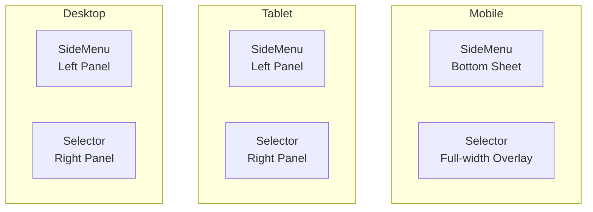

# NEAR Open Character Creator - Responsive Design Technical Specification

## Document Information
- **Project**: NEAR Open Character Creator
- **Version**: 1.0
- **Date**: 2026-01-12
- **Status**: Planning Phase

---

## Executive Summary

This specification provides a comprehensive technical plan for implementing responsive design improvements to the NEAR Open Character Creator. The current implementation uses CSS Modules with fixed positioning and absolute units throughout, with zero media queries and no mobile-specific optimizations.

### Current State Assessment
- **Zero media queries** in the entire codebase
- **Fixed pixel/em dimensions** throughout (e.g., MintPopup: 550px, ChatBox: 600px)
- **Absolute positioning** with fixed viewport offsets
- **Viewport restrictions** preventing zooming (accessibility issue)
- **No mobile layout adjustments** (side-by-side layouts don't stack)
- **Touch target sizes** may not meet WCAG guidelines

---

## 1. Responsive Strategy & Breakpoints

### 1.1 Breakpoint Strategy

Recommended breakpoints based on common device sizes and content requirements:

| Breakpoint Name | Min Width | Max Width | Target Devices | Layout Mode |
|----------------|------------|------------|----------------|-------------|
| **Mobile** | 0px | 480px | iPhone SE, small Android phones | Stacked, simplified |
| **Mobile Large** | 481px | 640px | iPhone 12/13/14, standard Android | Stacked, optimized |
| **Tablet** | 641px | 1024px | iPad, tablets | Hybrid layout |
| **Desktop** | 1025px | 1440px | Laptops, desktops | Full side-by-side |
| **Desktop Large** | 1441px+ | - | Large monitors | Full side-by-side |

### 1.2 Approach Recommendation: Mobile-First

**Rationale for Mobile-First Approach:**
1. **Simpler CSS**: Start with base styles for mobile, layer complexity with min-width media queries
2. **Performance**: Mobile users get minimal CSS, desktop gets progressive enhancement
3. **Content Priority**: Forces focus on essential features first
4. **Progressive Enhancement**: Aligns with modern web development best practices

**Implementation Pattern:**
```css
/* Base styles - Mobile First (0-480px) */
.Component {
  /* Mobile default styles */
}

/* Mobile Large (481px+) */
@media (min-width: 481px) {
  .Component {
    /* Adjustments for larger mobile */
  }
}

/* Tablet (641px+) */
@media (min-width: 641px) {
  .Component {
    /* Tablet adjustments */
  }
}

/* Desktop (1025px+) */
@media (min-width: 1025px) {
  .Component {
    /* Desktop side-by-side layout */
  }
}
```

### 1.3 Viewport Meta Tag Improvements

**Current Issue:**
```html
<meta name="viewport" content="width=device-width, initial-scale=1.0, maximum-scale=1.0, user-scalable=no" />
```

**Problems:**
- `maximum-scale=1.0` prevents zooming (WCAG 2.4.8 violation)
- `user-scalable=no` prevents users from zooming for accessibility

**Recommended Fix:**
```html
<meta name="viewport" content="width=device-width, initial-scale=1.0" />
```

**File to Modify:** [`index.html`](index.html:6)

---

## 2. Component-by-Component Responsive Specifications

### 2.1 Editor & SideMenu

**File:** [`src/components/Editor.module.css`](src/components/Editor.module.css:1)

#### Current Issues
- Fixed height: `39em` (~624px at 16px base)
- Absolute positioning: `left: 2em`, `top: 20vh`
- Perspective transform: `perspective(70vh) rotateY(5deg)`
- No width constraints

#### Responsive Behavior

| Breakpoint | Position | Height | Width | Transform | Layout |
|------------|----------|--------|-------|-----------|---------|
| Mobile (0-480px) | Fixed bottom sheet or left edge | 50vh | 60px (collapsed) / 80% (expanded) | None | Collapsible sidebar |
| Mobile Large (481-640px) | Left edge | 55vh | 80px | None | Collapsible sidebar |
| Tablet (641-1024px) | Left edge | 60vh | 100px | Reduced perspective | Side-by-side |
| Desktop (1025px+) | Left: 2em | 39em | Auto | `perspective(70vh) rotateY(5deg)` | Current layout |

#### CSS Changes Required

```css
/* Mobile Base (0-480px) */
.SideMenu {
    position: fixed;
    left: 0;
    top: auto;
    bottom: 0;
    height: 50vh;
    width: 60px;
    border: 2px solid #7aacba;
    border-radius: 5px 5px 0 0;
    backdrop-filter: blur(22.5px);
    box-sizing: border-box;
    transform: none;
    user-select: none;
    z-index: 1000;
    transition: width 0.3s ease;
}

.SideMenu.expanded {
    width: 80%;
}

/* Mobile Large (481px+) */
@media (min-width: 481px) {
    .SideMenu {
        height: 55vh;
        width: 80px;
    }
    .SideMenu.expanded {
        width: 70%;
    }
}

/* Tablet (641px+) */
@media (min-width: 641px) {
    .SideMenu {
        top: 15vh;
        bottom: auto;
        height: 60vh;
        width: 100px;
        transform: perspective(50vh) rotateY(2deg);
    }
    .SideMenu.expanded {
        width: 100px;
    }
}

/* Desktop (1025px+) */
@media (min-width: 1025px) {
    .SideMenu {
        left: 2em;
        top: 20vh;
        height: 39em;
        transform: perspective(70vh) rotateY(5deg);
    }
}
```

#### Touch Target Improvements
- `.MenuOption`: Ensure minimum 44x44px touch target
- `.ShuffleOption`: Currently 2.5em (40px) - needs to be 44px minimum

---

### 2.2 Selector

**File:** [`src/components/Selector.module.css`](src/components/Selector.module.css:1)

#### Current Issues
- Fixed height: `60vh`
- Absolute positioning: `right: 2em`, `top: 20vh`
- Perspective transform: `perspective(70vh) rotateY(-5deg)`
- No width constraints

#### Responsive Behavior

| Breakpoint | Position | Height | Width | Transform | Layout |
|------------|----------|--------|-------|-----------|---------|
| Mobile (0-480px) | Bottom sheet overlay | 50vh | 100% | None | Full-width bottom sheet |
| Mobile Large (481-640px) | Right edge or bottom | 55vh | 90% | None | Bottom sheet preferred |
| Tablet (641-1024px) | Right edge | 60vh | 40% | Reduced perspective | Side panel |
| Desktop (1025px+) | Right: 2em | 60vh | Auto | `perspective(70vh) rotateY(-5deg)` | Current layout |

#### CSS Changes Required

```css
/* Mobile Base (0-480px) */
.SelectorContainerPos {
    position: fixed;
    top: auto;
    bottom: 0;
    right: 0;
    left: 0;
    height: 50vh;
    overflow-y: scroll;
    overflow-x: hidden;
    border: 1px solid #7aacba;
    border-radius: 5px 5px 0 0;
    backdrop-filter: blur(22.5px);
    transform: none;
    z-index: 1000;
    cursor: pointer;
}

/* Mobile Large (481px+) */
@media (min-width: 481px) {
    .SelectorContainerPos {
        height: 55vh;
        right: 5%;
        left: 5%;
        width: 90%;
    }
}

/* Tablet (641px+) */
@media (min-width: 641px) {
    .SelectorContainerPos {
        top: 15vh;
        bottom: auto;
        right: 1em;
        left: auto;
        height: 60vh;
        width: 40%;
        transform: perspective(50vh) rotateY(-2deg);
    }
}

/* Desktop (1025px+) */
@media (min-width: 1025px) {
    .SelectorContainerPos {
        top: 20vh;
        right: 2em;
        width: auto;
        transform: perspective(70vh) rotateY(-5deg);
    }
}
```

#### Grid Layout for Trait Icons
- Mobile: 4 columns
- Tablet: 3 columns
- Desktop: 2 columns (current)

```css
.selector-container {
    display: grid;
    grid-template-columns: repeat(4, 1fr);
    gap: 0.5rem;
}

@media (min-width: 481px) {
    .selector-container {
        grid-template-columns: repeat(3, 1fr);
    }
}

@media (min-width: 1025px) {
    .selector-container {
        grid-template-columns: repeat(2, 1fr);
    }
}
```

---

### 2.3 MintPopup

**File:** [`src/components/MintPopup.module.css`](src/components/MintPopup.module.css:1)

#### Current Issues
- Fixed width: `550px`
- Full viewport overlay
- Grid layout with 2 columns
- No mobile adjustments

#### Responsive Behavior

| Breakpoint | Width | Grid Columns | Padding | Button Layout |
|------------|-------|--------------|----------|---------------|
| Mobile (0-480px) | 95% | 1 column | 15px | Stacked vertically |
| Mobile Large (481-640px) | 90% | 1 column | 15px | Stacked vertically |
| Tablet (641-1024px) | 80% | 2 columns | 20px | Side-by-side |
| Desktop (1025px+) | 550px | 2 columns | 10px | Current layout |

#### CSS Changes Required

```css
/* Mobile Base (0-480px) */
.StyledPopup {
    width: 95%;
    max-width: 550px;
    display: flex;
    flex-direction: column;
    position: relative;
    background-color: #1716168d;
    border-color: #7aacba;
    border-style: solid;
    border-width: 2px;
    border-radius: 10px;
    align-items: center;
    margin: 5% auto;
    padding: 15px;
    color: white;
    text-align: center;
    justify-content: space-evenly;
}

.TraitDetail {
    display: grid;
    grid-template-columns: 1fr;
    gap: 10px;
    margin: 15px;
}

.ButtonPanel {
    display: flex;
    flex-direction: column;
    justify-content: center;
    gap: 15px;
    margin: 15px;
}

/* Mobile Large (481px+) */
@media (min-width: 481px) {
    .StyledPopup {
        width: 90%;
    }
}

/* Tablet (641px+) */
@media (min-width: 641px) {
    .StyledPopup {
        width: 80%;
        padding: 20px;
    }
    .TraitDetail {
        grid-template-columns: repeat(2, 1fr);
        gap: 15px;
    }
    .ButtonPanel {
        flex-direction: row;
        gap: 50px;
    }
}

/* Desktop (1025px+) */
@media (min-width: 1025px) {
    .StyledPopup {
        width: 550px;
        padding: 10px 0 30px;
    }
}
```

#### Touch Targets
- `.StyledButton`: Currently 180px x 50px - meets WCAG minimum
- Ensure minimum 44px height on mobile

---

### 2.4 ChatBox

**File:** [`src/components/ChatBox.module.css`](src/components/ChatBox.module.css:1)

#### Current Issues
- Fixed width: `600px`
- Absolute positioning: `bottom: 10em`, centered horizontally
- Fixed message height: `180px`
- No mobile adjustments

#### Responsive Behavior

| Breakpoint | Width | Position | Message Height | Input Layout |
|------------|-------|----------|----------------|--------------|
| Mobile (0-480px) | 95% | Bottom: 0 | 40vh | Full-width input |
| Mobile Large (481-640px) | 90% | Bottom: 1em | 35vh | Full-width input |
| Tablet (641-1024px) | 80% | Bottom: 2em | 30vh | Side-by-side |
| Desktop (1025px+) | 600px | Bottom: 10em | 180px | Current layout |

#### CSS Changes Required

```css
/* Mobile Base (0-480px) */
.chatBox {
    z-index: 1000000;
    opacity: 0.95;
    position: fixed;
    width: 95%;
    max-width: 600px;
    min-height: 200px;
    font-size: 0.9rem;
    bottom: 0;
    left: 50%;
    transform: translateX(-50%);
    padding: 1em;
    margin: 0;
    color: #fff;
    background-color: rgb(51, 77, 97);
    border-radius: 5px 5px 0 0;
    border: 2px solid #7aacba;
    border-bottom: none;
}

.messages {
    display: flex;
    flex-direction: column;
    height: 40vh;
    overflow-y: auto;
    overflow-x: hidden;
    margin-bottom: 15px;
}

.send input {
    background-color: rgb(55, 74, 103);
    color: #fff;
    border-radius: 5px;
    border: 2px solid #7aacba;
    width: calc(100% - 60px);
    display: inline-block;
    padding: 10px;
    font-size: 16px; /* Prevents iOS zoom */
}

.send button {
    background-color: rgb(78, 141, 193);
    color: #fff;
    border: 2px solid #7aacba;
    border-radius: 5px;
    width: 50px;
    height: 44px;
    margin-left: 10px;
    font-size: 16px;
}

/* Mobile Large (481px+) */
@media (min-width: 481px) {
    .chatBox {
        width: 90%;
        bottom: 1em;
        border-radius: 5px;
        border-bottom: 2px solid #7aacba;
    }
    .messages {
        height: 35vh;
    }
}

/* Tablet (641px+) */
@media (min-width: 641px) {
    .chatBox {
        width: 80%;
        bottom: 2em;
    }
    .messages {
        height: 30vh;
    }
}

/* Desktop (1025px+) */
@media (min-width: 1025px) {
    .chatBox {
        width: 600px;
        bottom: 10em;
    }
    .messages {
        height: 180px;
    }
    .send input {
        width: calc(100% - 90px);
    }
}
```

---

### 2.5 UserMenu

**File:** [`src/components/UserMenu.module.css`](src/components/UserMenu.module.css:1)

#### Current Issues
- Fixed button sizes: `74px` x `74px`
- Absolute positioning: `top: 37px`, `right: 44px`
- No mobile adjustments

#### Responsive Behavior

| Breakpoint | Button Size | Position | Gap | Layout |
|------------|-------------|----------|-----|---------|
| Mobile (0-480px) | 50px | Top: 10px, Right: 10px | 10px | Horizontal row |
| Mobile Large (481-640px) | 60px | Top: 15px, Right: 15px | 15px | Horizontal row |
| Tablet (641-1024px) | 68px | Top: 20px, Right: 20px | 18px | Horizontal row |
| Desktop (1025px+) | 74px | Top: 37px, Right: 44px | 20px | Current layout |

#### CSS Changes Required

```css
/* Mobile Base (0-480px) */
.TopRightMenu {
    display: flex;
    top: 10px;
    right: 10px;
    position: fixed;
    gap: 10px;
    z-index: 1000;
}

.SquareButton {
    transition: 0.3s;
    font-family: Proxima;
    background-repeat: no-repeat;
    background-position: center;
    margin: auto;
    color: rgba(255, 255, 255, 0.5);
    width: 50px;
    height: 50px;
    border: 2px solid #7aacba;
    backdrop-filter: blur(22.5px);
    border-radius: 5px;
    display: flex;
    justify-content: center;
    align-items: center;
    box-sizing: border-box;
    opacity: 0.8;
    user-select: none;
    cursor: pointer;
}

/* Mobile Large (481px+) */
@media (min-width: 481px) {
    .TopRightMenu {
        top: 15px;
        right: 15px;
        gap: 15px;
    }
    .SquareButton {
        width: 60px;
        height: 60px;
    }
}

/* Tablet (641px+) */
@media (min-width: 641px) {
    .TopRightMenu {
        top: 20px;
        right: 20px;
        gap: 18px;
    }
    .SquareButton {
        width: 68px;
        height: 68px;
    }
}

/* Desktop (1025px+) */
@media (min-width: 1025px) {
    .TopRightMenu {
        top: 37px;
        right: 44px;
        gap: 20px;
    }
    .SquareButton {
        width: 74px;
        height: 74px;
    }
}
```

#### Wallet Info Adjustments
- Mobile: Hide wallet address text, show icon only
- Tablet+: Show truncated address

```css
.WalletInfo {
    display: none;
}

@media (min-width: 641px) {
    .WalletInfo {
        display: block;
        overflow: hidden;
        text-align: right;
        text-overflow: ellipsis;
        text-transform: uppercase;
        width: 120px;
        font-size: 12px;
        margin: auto;
        margin-left: -10px;
    }
}

@media (min-width: 1025px) {
    .WalletInfo {
        width: 164px;
        font-size: 14px;
    }
}
```

---

### 2.6 Bottom Action Buttons (AR, Audio, Chat)

**Files:**
- [`src/components/ARButton.module.css`](src/components/ARButton.module.css:1)
- [`src/components/AudioButton.module.css`](src/components/AudioButton.module.css:1)
- [`src/components/ChatButton.module.css`](src/components/ChatButton.module.css:1)

#### Current Issues
- Fixed position: `bottom: 2em`, `right: 2em` / `right: 6em`
- Fixed size: `3em` x `3em` (48px)
- Overlapping on mobile
- No mobile adjustments

#### Responsive Behavior

| Breakpoint | Button Size | Position | Spacing | Layout |
|------------|-------------|----------|---------|---------|
| Mobile (0-480px) | 44px | Bottom: 10px, Right: 10px | 10px | Horizontal row |
| Mobile Large (481-640px) | 48px | Bottom: 15px, Right: 15px | 12px | Horizontal row |
| Tablet (641-1024px) | 52px | Bottom: 20px, Right: 20px | 15px | Stacked vertical |
| Desktop (1025px+) | 3em (48px) | Bottom: 2em, Right: 2em/6em | 4em | Current layout |

#### CSS Changes Required

**ARButton.module.css:**
```css
/* Mobile Base (0-480px) */
.SquareButton {
    position: fixed;
    bottom: 10px;
    right: 10px;
    transition: 0.3s;
    background-size: 1.5em;
    background-repeat: no-repeat;
    background-position: center;
    color: rgba(255, 255, 255);
    width: 44px;
    height: 44px;
    border: 2px solid #7aacba;
    backdrop-filter: blur(22.5px);
    border-radius: 5px;
    opacity: 1;
    user-select: none;
    cursor: pointer;
    z-index: 1000;
}

/* Mobile Large (481px+) */
@media (min-width: 481px) {
    .SquareButton {
        bottom: 15px;
        right: 15px;
        width: 48px;
        height: 48px;
    }
}

/* Tablet (641px+) */
@media (min-width: 641px) {
    .SquareButton {
        bottom: 20px;
        right: 20px;
        width: 52px;
        height: 52px;
    }
}

/* Desktop (1025px+) */
@media (min-width: 1025px) {
    .SquareButton {
        bottom: 2em;
        right: 6em;
        width: 3em;
        height: 3em;
    }
}
```

**AudioButton.module.css:**
```css
/* Mobile Base (0-480px) */
.SquareButton {
    position: fixed;
    bottom: 10px;
    right: 64px; /* 10px + 44px + 10px */
    transition: 0.3s;
    background-size: 1.5em;
    background-repeat: no-repeat;
    background-position: center;
    color: rgba(255, 255, 255);
    width: 44px;
    height: 44px;
    border: 2px solid #7aacba;
    backdrop-filter: blur(22.5px);
    border-radius: 5px;
    opacity: 1;
    user-select: none;
    cursor: pointer;
    z-index: 1000;
}

/* Mobile Large (481px+) */
@media (min-width: 481px) {
    .SquareButton {
        bottom: 15px;
        right: 75px; /* 15px + 48px + 12px */
        width: 48px;
        height: 48px;
    }
}

/* Tablet (641px+) */
@media (min-width: 641px) {
    .SquareButton {
        bottom: 20px;
        right: 20px;
        width: 52px;
        height: 52px;
    }
}

/* Desktop (1025px+) */
@media (min-width: 1025px) {
    .SquareButton {
        bottom: 2em;
        right: 2em;
        width: 3em;
        height: 3em;
    }
}
```

**ChatButton.module.css:**
```css
/* Mobile Base (0-480px) */
.SquareButton {
    position: fixed;
    bottom: 10px;
    right: 10px;
    transition: 0.3s;
    background-size: 1.5em;
    background-repeat: no-repeat;
    background-position: center;
    color: rgba(255, 255, 255);
    width: 44px;
    height: 44px;
    border: 2px solid #7aacba;
    backdrop-filter: blur(22.5px);
    border-radius: 5px;
    opacity: 1;
    user-select: none;
    cursor: pointer;
    z-index: 1000;
}

/* Mobile Large (481px+) */
@media (min-width: 481px) {
    .SquareButton {
        bottom: 15px;
        right: 15px;
        width: 48px;
        height: 48px;
    }
}

/* Tablet (641px+) */
@media (min-width: 641px) {
    .SquareButton {
        bottom: 72px; /* 20px + 52px */
        right: 20px;
        width: 52px;
        height: 52px;
    }
}

/* Desktop (1025px+) */
@media (min-width: 1025px) {
    .SquareButton {
        bottom: 2em;
        right: 2em;
        width: 3em;
        height: 3em;
    }
}
```

---

### 2.7 BackButton

**File:** [`src/components/BackButton.module.css`](src/components/BackButton.module.css:1)

#### Current Issues
- Fixed size: `4em` x `4em` (64px)
- Absolute positioning: `margin-left: 2em`, `margin-top: 2em`
- No mobile adjustments

#### Responsive Behavior

| Breakpoint | Button Size | Position |
|------------|-------------|----------|
| Mobile (0-480px) | 44px | Top: 10px, Left: 10px |
| Mobile Large (481-640px) | 50px | Top: 15px, Left: 15px |
| Tablet (641-1024px) | 56px | Top: 20px, Left: 20px |
| Desktop (1025px+) | 4em (64px) | Margin-left: 2em, Margin-top: 2em |

#### CSS Changes Required

```css
/* Mobile Base (0-480px) */
.StyledBackButton {
    background: url('/ui/backButton_white.png') center center no-repeat;
    background-size: 45% 55%;
    width: 44px;
    height: 44px;
    backdrop-filter: blur(22.5px);
    border-radius: 5px;
    box-sizing: border-box;
    opacity: 1;
    user-select: none;
    position: absolute;
    z-index: 100000;
    left: 10px;
    top: 10px;
    border: 2px solid #7aacba;
}

/* Mobile Large (481px+) */
@media (min-width: 481px) {
    .StyledBackButton {
        width: 50px;
        height: 50px;
        left: 15px;
        top: 15px;
    }
}

/* Tablet (641px+) */
@media (min-width: 641px) {
    .StyledBackButton {
        width: 56px;
        height: 56px;
        left: 20px;
        top: 20px;
    }
}

/* Desktop (1025px+) */
@media (min-width: 1025px) {
    .StyledBackButton {
        width: 4em;
        height: 4em;
        margin-left: 2em;
        margin-top: 2em;
        left: auto;
        top: auto;
    }
}
```

---

### 2.8 LoadingOverlay

**File:** [`src/components/LoadingOverlay.module.css`](src/components/LoadingOverlay.module.css:1)

#### Current Issues
- Full viewport overlay (appropriate)
- Fixed spinner size: `5em`
- No mobile adjustments needed

#### Responsive Behavior
- **All breakpoints**: Full viewport overlay remains appropriate
- Spinner scales with viewport using `min(30vh, 30vw)` - already responsive

#### Minor Improvements
```css
.loading-spinner {
    width: min(5em, 20vw);
    height: min(5em, 20vw);
    border: 5px solid #430086;
    border-top: 5px solid #2c0026;
    border-radius: 50%;
    animation: spinner 1.5s linear infinite;
    display: inline-block;
    float: right;
}
```

---

### 2.9 Scene & Background

**Files:**
- [`src/components/Scene.module.css`](src/components/Scene.module.css:1)
- [`src/components/Background.module.css`](src/components/Background.module.css:1)

#### Current State
- Already uses viewport units (`100vw`, `100vh`)
- Appropriate for responsive design

#### No Changes Required
These components are already responsive using viewport units.

---

## 3. Global Responsive Patterns

### 3.1 Reusable Utility Classes

Create a new file: [`src/styles/responsive.css`](src/styles/responsive.css)

```css
/* Container Queries - Future Enhancement */
@supports (container-type: inline-size) {
    .responsive-container {
        container-type: inline-size;
    }
}

/* Spacing Scale */
.spacing-xs { padding: 0.5rem; }
.spacing-sm { padding: 1rem; }
.spacing-md { padding: 1.5rem; }
.spacing-lg { padding: 2rem; }
.spacing-xl { padding: 3rem; }

/* Flexbox Utilities */
.flex-center {
    display: flex;
    justify-content: center;
    align-items: center;
}

.flex-between {
    display: flex;
    justify-content: space-between;
    align-items: center;
}

.flex-column {
    display: flex;
    flex-direction: column;
}

/* Grid Utilities */
.grid-2 { display: grid; grid-template-columns: repeat(2, 1fr); gap: 1rem; }
.grid-3 { display: grid; grid-template-columns: repeat(3, 1fr); gap: 1rem; }
.grid-4 { display: grid; grid-template-columns: repeat(4, 1fr); gap: 1rem; }

/* Text Utilities */
.text-truncate {
    overflow: hidden;
    text-overflow: ellipsis;
    white-space: nowrap;
}

/* Touch Target Utilities */
.touch-target-min {
    min-width: 44px;
    min-height: 44px;
}

/* Visibility Utilities */
.mobile-only { display: block; }
.tablet-only { display: none; }
.desktop-only { display: none; }

@media (min-width: 641px) {
    .mobile-only { display: none; }
    .tablet-only { display: block; }
}

@media (min-width: 1025px) {
    .tablet-only { display: none; }
    .desktop-only { display: block; }
}
```

### 3.2 Consistent Spacing Scale

| Scale | Mobile | Tablet | Desktop |
|-------|---------|---------|---------|
| XS | 0.5rem (8px) | 0.75rem (12px) | 1rem (16px) |
| SM | 1rem (16px) | 1.25rem (20px) | 1.5rem (24px) |
| MD | 1.5rem (24px) | 2rem (32px) | 2.5rem (40px) |
| LG | 2rem (32px) | 2.5rem (40px) | 3rem (48px) |
| XL | 3rem (48px) | 4rem (64px) | 5rem (80px) |

### 3.3 Touch Target Guidelines

**WCAG 2.5.5 Requirement:**
- Minimum touch target size: **44x44 pixels**
- Recommended: **48x48 pixels** for better usability

**Implementation:**
```css
/* Base touch target class */
.touch-target {
    min-width: 44px;
    min-height: 44px;
    min-touch-action: manipulation; /* Prevents double-tap zoom */
}

/* Enhanced touch target for better usability */
.touch-target-lg {
    min-width: 48px;
    min-height: 48px;
    min-touch-action: manipulation;
}

/* Spacing between touch targets */
.touch-group > * + * {
    margin-left: 8px;
}
```

---

## 4. CSS Module Updates Plan

### 4.1 Files Requiring Modifications

| File | Priority | Changes | New Media Queries |
|------|-----------|----------|------------------|
| [`index.html`](index.html:6) | Critical | Update viewport meta tag | N/A |
| [`src/components/Editor.module.css`](src/components/Editor.module.css:1) | High | SideMenu responsive, touch targets | 4 |
| [`src/components/Selector.module.css`](src/components/Selector.module.css:1) | High | Selector responsive, grid layout | 4 |
| [`src/components/MintPopup.module.css`](src/components/MintPopup.module.css:1) | High | Popup width, grid columns | 3 |
| [`src/components/ChatBox.module.css`](src/components/ChatBox.module.css:1) | High | Width, position, message height | 4 |
| [`src/components/UserMenu.module.css`](src/components/UserMenu.module.css:1) | Medium | Button sizes, position | 4 |
| [`src/components/ARButton.module.css`](src/components/ARButton.module.css:1) | Medium | Position, size | 4 |
| [`src/components/AudioButton.module.css`](src/components/AudioButton.module.css:1) | Medium | Position, size | 4 |
| [`src/components/ChatButton.module.css`](src/components/ChatButton.module.css:1) | Medium | Position, size | 4 |
| [`src/components/BackButton.module.css`](src/components/BackButton.module.css:1) | Low | Position, size | 4 |
| [`src/components/LoadingOverlay.module.css`](src/components/LoadingOverlay.module.css:1) | Low | Spinner scaling | 1 |

### 4.2 New Files to Create

| File | Purpose |
|------|---------|
| [`src/styles/responsive.css`](src/styles/responsive.css) | Utility classes, global responsive patterns |
| [`src/styles/variables.css`](src/styles/variables.css) | CSS custom properties for breakpoints, spacing |

### 4.3 CSS Custom Properties

Create [`src/styles/variables.css`](src/styles/variables.css):

```css
:root {
    /* Breakpoints */
    --bp-mobile: 480px;
    --bp-mobile-lg: 641px;
    --bp-tablet: 1024px;
    --bp-desktop: 1440px;

    /* Spacing Scale */
    --spacing-xs: 0.5rem;
    --spacing-sm: 1rem;
    --spacing-md: 1.5rem;
    --spacing-lg: 2rem;
    --spacing-xl: 3rem;

    /* Touch Targets */
    --touch-target-min: 44px;
    --touch-target-lg: 48px;

    /* Colors */
    --color-border: #7aacba;
    --color-accent: aqua;
    --color-primary: rgb(51, 77, 97);
    --color-text: #ffffff;

    /* Border Radius */
    --radius-sm: 5px;
    --radius-md: 10px;
    --radius-lg: 15px;

    /* Z-Index Scale */
    --z-overlay: 1000;
    --z-modal: 10000;
    --z-loading: 100000;
    --z-chat: 1000000;
}

@media (min-width: 641px) {
    :root {
        --spacing-xs: 0.75rem;
        --spacing-sm: 1.25rem;
        --spacing-md: 2rem;
        --spacing-lg: 2.5rem;
        --spacing-xl: 4rem;
    }
}

@media (min-width: 1025px) {
    :root {
        --spacing-xs: 1rem;
        --spacing-sm: 1.5rem;
        --spacing-md: 2.5rem;
        --spacing-lg: 3rem;
        --spacing-xl: 5rem;
    }
}
```

### 4.4 Shared Patterns to Abstract

1. **Button Base Styles** - Create shared button class
2. **Modal/Popup Base Styles** - Shared overlay and container styles
3. **Scrollable Container Styles** - Unified scrollbar styling
4. **Backdrop Filter Styles** - Consistent blur effects

---

## 5. Accessibility Considerations

### 5.1 Viewport Scaling

**Current Issue (WCAG 2.4.8 Violation):**
```html
<meta name="viewport" content="width=device-width, initial-scale=1.0, maximum-scale=1.0, user-scalable=no" />
```

**Required Fix:**
```html
<meta name="viewport" content="width=device-width, initial-scale=1.0" />
```

**Rationale:**
- Allows users to zoom up to 200% (WCAG AA requirement)
- Preserves accessibility for users with low vision
- Prevents blocking of essential user control

### 5.2 Touch Target Size Requirements

**WCAG 2.5.5 (Level AAA):**
- Minimum: **44x44 pixels**
- Recommended: **48x48 pixels**

**Components Requiring Updates:**

| Component | Current Size | Required Size | Status |
|-----------|--------------|----------------|---------|
| MenuOption | 3.5em (~56px) | 44px | ✓ Compliant |
| ShuffleOption | 2.5em (~40px) | 44px | ✗ Non-compliant |
| SquareButton (UserMenu) | 74px | 44px | ✓ Compliant |
| Audio/AR/Chat Buttons | 3em (~48px) | 44px | ✓ Compliant |
| BackButton | 4em (~64px) | 44px | ✓ Compliant |

### 5.3 Keyboard Navigation

**Requirements:**
- All interactive elements must be focusable
- Visible focus indicators
- Logical tab order
- Escape key to close modals

**Implementation:**
```css
/* Focus Styles */
*:focus-visible {
    outline: 2px solid var(--color-accent);
    outline-offset: 2px;
}

/* Skip Link for Keyboard Users */
.skip-link {
    position: absolute;
    top: -40px;
    left: 0;
    background: var(--color-primary);
    color: white;
    padding: 8px;
    z-index: 9999;
    transition: top 0.3s;
}

.skip-link:focus {
    top: 0;
}
```

### 5.4 Screen Reader Considerations

**ARIA Labels:**
- All icon-only buttons need `aria-label`
- Live regions for dynamic content (chat messages)
- Proper heading hierarchy

**Example:**
```jsx
<button aria-label="Toggle audio" className={styles['SquareButton']}>
```

### 5.5 Color Contrast

**WCAG 2.1 Requirements:**
- Normal text: 4.5:1 (AA), 7:1 (AAA)
- Large text (18px+): 3:1 (AA), 4.5:1 (AAA)
- UI components: 3:1 (AA)

**Current Colors to Verify:**
- Border: `#7aacba` on dark backgrounds
- Text: `#ffffff` on `rgb(51, 77, 97)`
- Accent: `aqua` on various backgrounds

---

## 6. Implementation Priority

### Phase 1: Critical Fixes (Prevent Breakage)

**Goal:** Ensure basic functionality on mobile devices without layout breakage.

| Task | File | Effort | Impact |
|------|------|---------|--------|
| Fix viewport meta tag | [`index.html`](index.html:6) | Low | High |
| Add mobile media queries to Editor | [`src/components/Editor.module.css`](src/components/Editor.module.css:1) | Medium | High |
| Add mobile media queries to Selector | [`src/components/Selector.module.css`](src/components/Selector.module.css:1) | Medium | High |
| Add mobile media queries to MintPopup | [`src/components/MintPopup.module.css`](src/components/MintPopup.module.css:1) | Low | High |
| Add mobile media queries to ChatBox | [`src/components/ChatBox.module.css`](src/components/ChatBox.module.css:1) | Medium | High |
| Fix ShuffleOption touch target | [`src/components/Editor.module.css`](src/components/Editor.module.css:67) | Low | Medium |

**Acceptance Criteria:**
- No horizontal overflow on mobile devices
- All content is accessible on 320px width
- Touch targets meet WCAG minimum
- Basic navigation works on mobile

### Phase 2: Layout Improvements (Stacking & Repositioning)

**Goal:** Improve user experience with proper layout adjustments per breakpoint.

| Task | File | Effort | Impact |
|------|------|---------|--------|
| Add tablet media queries to all components | All CSS modules | Medium | High |
| Implement responsive grid for Selector | [`src/components/Selector.module.css`](src/components/Selector.module.css:16) | Low | Medium |
| Add collapsible sidebar for Editor | [`src/components/Editor.module.css`](src/components/Editor.module.css:1) + JSX | High | High |
| Reposition bottom action buttons | AR/Audio/Chat CSS | Medium | Medium |
| Adjust UserMenu button sizes | [`src/components/UserMenu.module.css`](src/components/UserMenu.module.css:1) | Low | Medium |

**Acceptance Criteria:**
- Side-by-side layouts stack on mobile
- Bottom sheets for mobile, side panels for desktop
- Smooth transitions between breakpoints
- Consistent spacing across breakpoints

### Phase 3: Polish (Animations, Transitions, Edge Cases)

**Goal:** Enhance user experience with smooth interactions and handle edge cases.

| Task | File | Effort | Impact |
|------|------|---------|--------|
| Add smooth transitions for responsive changes | All CSS modules | Medium | Medium |
| Implement keyboard navigation styles | [`src/styles/responsive.css`](src/styles/responsive.css) | Low | High |
| Add ARIA labels to icon buttons | All JSX components | Medium | High |
| Create utility classes | [`src/styles/responsive.css`](src/styles/responsive.css) | Low | Low |
| Add CSS custom properties | [`src/styles/variables.css`](src/styles/variables.css) | Low | Low |
| Test on various devices | N/A | Medium | High |
| Handle landscape orientation | All CSS modules | Medium | Medium |

**Acceptance Criteria:**
- Smooth animations when switching breakpoints
- Full keyboard accessibility
- Proper ARIA labels throughout
- Tested on iPhone, Android, iPad, Desktop
- Works in both portrait and landscape

---

## 7. App Mode-Specific Considerations

### 7.1 APPEARANCE Mode (Character Editor)

**Components:** Editor + SideMenu + Selector

**Responsive Strategy:**
- Mobile: Bottom sheet for SideMenu, full-width overlay for Selector
- Tablet: Reduced side panels with smaller perspective transforms
- Desktop: Current side-by-side layout

**Layout Diagram:**



### 7.2 MINT Mode (NFT Minting)

**Components:** MintPopup

**Responsive Strategy:**
- Mobile: Full-width popup with stacked content
- Tablet: Centered popup with 2-column grid
- Desktop: Fixed-width popup (550px)

### 7.3 CHAT Mode (AI Chat)

**Components:** ChatComponent + ChatButton

**Responsive Strategy:**
- Mobile: Full-width chat at bottom, button in corner
- Tablet: Centered chat, button in corner
- Desktop: Fixed-width chat (600px), button in corner

### 7.4 AR Mode (Augmented Reality)

**Components:** ARButton

**Responsive Strategy:**
- Mobile: Button in bottom-right corner, 44px
- Tablet+: Button in bottom-right, scaled appropriately

---

## 8. Testing Strategy

### 8.1 Device Testing Matrix

| Device Type | Viewport Width | Test Cases |
|-------------|----------------|------------|
| iPhone SE | 375px | All components, touch targets |
| iPhone 12/13 | 390px | All components, orientation |
| iPhone 14 Pro Max | 430px | All components, orientation |
| iPad Mini | 768px | Tablet layout, landscape |
| iPad Pro | 1024px | Tablet/desktop boundary |
| Desktop | 1920px | Full layout, zoom |

### 8.2 Browser Testing

- Chrome (Desktop & Mobile)
- Safari (iOS & macOS)
- Firefox
- Edge

### 8.3 Accessibility Testing

- Keyboard navigation (Tab, Enter, Escape, Arrow keys)
- Screen reader (VoiceOver, NVDA)
- Zoom (200%)
- Color contrast analysis

### 8.4 Performance Testing

- Lighthouse score (Mobile)
- First Contentful Paint
- Time to Interactive
- Cumulative Layout Shift

---

## 9. Migration Notes

### 9.1 Backward Compatibility

- All existing class names preserved
- Desktop (1025px+) maintains current appearance
- Progressive enhancement approach ensures graceful degradation

### 9.2 Breaking Changes

None - this is additive responsive design.

### 9.3 Future Enhancements

1. **Container Queries** - For component-level responsiveness
2. **CSS Grid** - Replace flexbox for complex layouts
3. **Sub-pixel Rendering** - For sharper text on high-DPI displays
4. **Reduced Motion** - Respect `prefers-reduced-motion`

---

## 10. Summary

This specification provides a comprehensive roadmap for implementing responsive design across the NEAR Open Character Creator. Key outcomes:

1. **Mobile-First Approach** - Ensures mobile users get optimal experience
2. **Progressive Enhancement** - Desktop users get enhanced layouts
3. **Accessibility Compliance** - WCAG 2.1 AA standards
4. **Phased Implementation** - Critical fixes first, polish later
5. **Maintainable Code** - Utility classes and CSS custom properties

**Total Files to Modify:** 11
**Total New Files:** 2
**Total Media Queries to Add:** ~40
**Estimated Touch Targets to Fix:** 1 (ShuffleOption)

---

## Appendix A: CSS Module Reference

| File | Classes | Lines |
|------|---------|-------|
| [`Editor.module.css`](src/components/Editor.module.css:1) | SideMenu, LineDivision, MenuImg, MenuOption, MenuOptionSelected, MenuImgActive, ShuffleOption, ShuffleOptionActive, MenuTitle, LoadingContainer, Loading, LoadingText | 135 |
| [`Selector.module.css`](src/components/Selector.module.css:1) | SelectorContainerPos, selector-container, selector-button, active, selectorButton, trait-icon, tickStyle, tickStyleInActive, loading-trait, icon-hidden, loading-trait-overlay, loading-trait-overlay-show | 113 |
| [`MintPopup.module.css`](src/components/MintPopup.module.css:1) | StyledButton, StyledContainer, Title, StyledBackground, StyledPopup, Header, ButtonPanel, TraitDetail, TraitImage, TraitText, MintCost, TraitBox, MintPriceBox | 193 |
| [`ChatBox.module.css`](src/components/ChatBox.module.css:1) | chatBox, messages, send | 72 |
| [`UserMenu.module.css`](src/components/UserMenu.module.css:1) | SquareButton, TopRightMenu, WalletInfo, WalletImg, WalletButton, DownloadButton, MintButton, TextButton, userBoxWrap, loggedOutText, loginButton, loggedInText, chainName, walletAddress, chainTitle | 222 |
| [`ARButton.module.css`](src/components/ARButton.module.css:1) | SquareButton, StyledAudioButton, AROn, AROff | 39 |
| [`AudioButton.module.css`](src/components/AudioButton.module.css:1) | SquareButton, StyledAudioButton, AudioOn, AudioOff | 39 |
| [`ChatButton.module.css`](src/components/ChatButton.module.css:1) | SquareButton, StyledAudioButton, Chat, Dress | 38 |
| [`BackButton.module.css`](src/components/BackButton.module.css:1) | StyledBackButton | 26 |
| [`LoadingOverlay.module.css`](src/components/LoadingOverlay.module.css:1) | LoadingStyleBox, loading-text, loading-spinner, logo-container, webamark, logo-gradient | 74 |
| [`Scene.module.css`](src/components/Scene.module.css:1) | FitParentContainer, ScreenSizeContainer, Background, webamark, logo | 39 |
| [`Background.module.css`](src/components/Background.module.css:1) | backgroundImg, Background, webamark, logo | 43 |

---

## Appendix B: Media Query Syntax Reference

```css
/* Mobile First Syntax */
@media (min-width: 481px) { /* Mobile Large */ }
@media (min-width: 641px) { /* Tablet */ }
@media (min-width: 1025px) { /* Desktop */ }
@media (min-width: 1441px) { /* Desktop Large */ }

/* Alternative: Desktop First Syntax */
@media (max-width: 1440px) { /* Desktop */ }
@media (max-width: 1024px) { /* Tablet */ }
@media (max-width: 640px) { /* Mobile Large */ }
@media (max-width: 480px) { /* Mobile */ }

/* Combined Syntax (Range) */
@media (min-width: 481px) and (max-width: 640px) { /* Mobile Large only */ }
```

---

## Appendix C: Touch Target Calculator

| em Value | 16px Base | 18px Base | 20px Base |
|----------|------------|------------|------------|
| 2.5em | 40px ✗ | 45px ✓ | 50px ✓ |
| 3em | 48px ✓ | 54px ✓ | 60px ✓ |
| 3.5em | 56px ✓ | 63px ✓ | 70px ✓ |
| 4em | 64px ✓ | 72px ✓ | 80px ✓ |

**Note:** WCAG minimum is 44x44px. The ShuffleOption at 2.5em is only 40px at 16px base font size.

---

*End of Specification*
